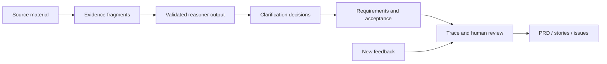

# SpecLoop

SpecLoop 是一个证据驱动的需求澄清与验收 Agent。它把会议记录、聊天摘录、用户反馈和项目文档转成一条可审计链路：

`原始证据 -> 用户问题 -> 产品决策 -> 需求条目 -> 验收标准`

它不是会议纪要摘要器。SpecLoop 会保留矛盾和不确定性，只提出会改变实现或验收的信息增益问题，并在新反馈进入后标记可能失效的旧结论。

## Product demo

1. 粘贴材料，或上传 TXT、Markdown、JSON、PDF、DOCX。
2. 查看冲突、缺失条件和未经验证的假设。
3. 逐个回答最多 5 个高信息增益问题。
4. 编辑需求、优先级和 Given / When / Then 验收标准。
5. 在交互图中从验收标准回溯到原文和行号。
6. 添加新反馈，复核被标为 `at-risk` 的决策和需求。
7. 导出带证据引用的 PRD、用户故事或 GitHub Issue Markdown。

## Architecture



领域状态机始终拥有最终控制权。模型只能提出结构化 findings 和问题；Zod 校验、证据 ID 白名单、5 问上限和状态守卫会在模型输出进入项目之前执行。

## Run without an API key

```bash
npm install
npm run build
npm run preview
```

打开 `http://127.0.0.1:4173/`，点击 `Load demo` 即可完成可复现演示。

## Run with the model adapter

密钥只放在 Node 服务端，不会进入前端包、`localStorage` 或 Git 历史。

```powershell
$env:OPENAI_API_KEY="your-key"
$env:OPENAI_MODEL="gpt-5-mini"
npm run build
npm run start:model
```

打开 `http://127.0.0.1:8787/`，在 `Preferences -> Reasoner` 选择 `Model`。模型服务不可用时，系统保留确定性分析结果并写入 `model.analysis.fallback` 审计事件。

服务端适配器使用 OpenAI [Responses API](https://platform.openai.com/docs/api-reference/responses) 的 JSON Schema 输出。模型名可通过 `OPENAI_MODEL` 替换。

## Evaluation and verification

```bash
npm run check
```

- 8 条带正负样例的冲突 smoke fixtures，在当前小型合成集上 binary precision / recall 均为 100%。
- 契约测试覆盖 5 问上限、模型伪造 evidence ID 拒绝、100% 追踪覆盖、选择性变更影响、人工复核闭环和三种导出格式。
- 该结果只描述仓库内 smoke set，不代表开放域自然语言准确率；限制记录在 [Evaluation](docs/EVALUATION.md)。

## Deployment

合并到 `main` 后，`pages.yml` 会运行完整检查并部署静态 Demo 到 GitHub Pages。Model 模式需要单独部署 `server/agent-server.mjs`，GitHub Pages 版本会继续使用无需密钥的 Demo Reasoner。

## Project map

- `src/core/`：领域模型、状态机、Reasoner、模型输出校验、影响分析、导出和持久化。
- `src/components/`：材料、澄清、需求、追踪、评审和评测界面。
- `server/`：服务器端 Responses API 适配层和生产静态服务。
- `evals/`：带正负样例的行为评测数据。
- `docs/`：PRD、架构、调研、评测、演示脚本与简历材料。

## MVP boundaries

首版不做实时会议转写、多人协作、Jira/Linear/GitHub 双向同步、多 Agent 编排或云端账号系统。项目数据默认只保存在浏览器本地。

## Documentation

- [PRD](docs/PRD.md)
- [Architecture](docs/ARCHITECTURE.md)
- [Evaluation](docs/EVALUATION.md)
- [Three-minute demo](docs/DEMO.md)
- [Open-source research](docs/OPEN_SOURCE_RESEARCH.md)
- [Resume notes](docs/RESUME.md)

## License

MIT
