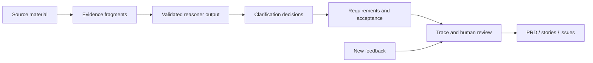

# SpecLoop

SpecLoop 是一个证据驱动的需求澄清与验收 Agent。它把会议记录、聊天摘录、用户反馈和项目文档转成一条可审计链路：

`原始证据 -> 用户问题 -> 产品决策 -> 需求条目 -> 验收标准`

它不是会议纪要摘要器。SpecLoop 会保留矛盾和不确定性，只提出会改变实现或验收的信息增益问题，并在新反馈进入后标记可能失效的旧结论。

## Product demo

1. 粘贴材料，或上传 TXT、Markdown、JSON、PDF、DOCX。
2. 查看冲突、缺失条件和未经验证的假设。
3. 按材料复杂度进入 1 / 3 / 5 问上限，并在阻断风险解决后自动早停。
4. 编辑需求、优先级和 Given / When / Then 验收标准。
5. 在交互图中从验收标准回溯到原文和行号。
6. 添加新反馈，复核被标为 `at-risk` 的决策和需求。
7. 导出带证据引用的 PRD、用户故事或 GitHub Issue Markdown。
8. 在 Evaluation 查看三分类路由混淆矩阵、早停效率，以及真实模型调用的 Token、估算成本、延迟、状态和 request ID。
9. 打开 `Guided demo` 和 `Case study`，查看可复现演示与 AI 产品作品集。

## Architecture



领域状态机始终拥有最终控制权。模型只能提出结构化 findings、问题和自评信号；Zod 校验、证据 ID 白名单、自适应问题预算和状态守卫会在模型输出进入项目之前执行。

## Run without an API key

```bash
npm install
npm run build
npm run preview
```

打开 `http://127.0.0.1:4173/`，点击 `Load demo` 即可完成可复现演示。

## Run with the model adapter

密钥只放在 Node 服务端，不会进入前端包、`localStorage` 或 Git 历史。

```powershell
$env:OPENAI_API_KEY="your-key"
$env:OPENAI_MODEL="gpt-5-mini"
$env:OPENAI_MODEL_SMALL="gpt-5-mini"
$env:OPENAI_MODEL_LARGE="<verified-quality-model-id>"
$env:OPENAI_INPUT_USD_PER_1M="copy-current-provider-rate"
$env:OPENAI_CACHED_INPUT_USD_PER_1M="copy-current-provider-rate"
$env:OPENAI_OUTPUT_USD_PER_1M="copy-current-provider-rate"
npm run build
npm run start:model
```

打开 `http://127.0.0.1:8787/`，在 `Preferences -> Reasoner` 选择 `Model`。模型服务不可用时，系统保留确定性分析结果并写入 `model.analysis.fallback` 审计事件。

服务端适配器使用 OpenAI [Responses API](https://platform.openai.com/docs/api-reference/responses) 的 JSON Schema 输出，并将响应 `usage` 记录为项目级 Agent Run。每次运行保存输入、缓存输入、输出、推理和总 Token，以及服务端/浏览器端延迟和 provider request ID。成本按服务端配置的每百万 Token 单价估算；未配置单价时界面显示 `Not priced`，不会显示误导性的零成本。

调用设置 `store: false`。`OPENAI_MODEL_SMALL` / `OPENAI_MODEL_LARGE` 分别承接复杂与高风险材料；未配置时统一回退到 `OPENAI_MODEL`。价格应按部署时的官方报价写入环境变量，不在代码中硬编码。

## Connect a deployed model backend

静态 Pages 不持有密钥。将 `server/agent-server.mjs` 部署到 Node 服务后：

1. 后端设置 `OPENAI_API_KEY`、模型、三项价格变量以及 `HOST=0.0.0.0`。
2. 后端设置 `ALLOWED_ORIGIN=https://0101xiayingluo.github.io`。
3. GitHub 仓库变量 `VITE_AGENT_API_URL` 设置为后端公开地址。
4. 重新运行 Pages workflow。

本地同源运行不需要 `VITE_AGENT_API_URL` 或 CORS 配置。

仓库包含生产 Dockerfile 和 Render Blueprint。完整步骤见 [Deployment guide](docs/DEPLOYMENT.md)。公开模型端点额外启用来源校验、每 IP 限流、并发上限与 Provider 超时，避免仅依赖 CORS 控制付费接口。

## Evaluation and verification

```bash
npm run check
```

- 8 条带正负样例的冲突 smoke fixtures，在当前小型合成集上 binary precision / recall 均为 100%。
- 48 项契约与工作流测试覆盖证据归一化/去重、`risk-floor-v2` 三级路由、模型能力降级、信息增益早停、模型伪造 evidence ID 拒绝、usage/成本归一化、失败 telemetry、服务端限流、100% 追踪覆盖、选择性变更影响、人工复核闭环和三种导出格式。
- 12 条 simple / complex / high-risk 合成路由 fixtures 当前为 12/12；Evaluation 展示 3 × 3 混淆矩阵，并固化一个旧策略的 high-severity omission 误判 case。
- 5 次独立本地回归运行共 240/240 次测试执行通过，未观察到 flaky case；该结论仅适用于本次本地重复运行。
- 该结果只描述仓库内 smoke set，不代表开放域自然语言准确率；限制记录在 [Evaluation](docs/EVALUATION.md)。

## Deployment

合并到 `main` 后，`pages.yml` 会运行完整检查并部署到 GitHub Pages。未设置仓库变量 `VITE_AGENT_API_URL` 时运行无需密钥的 Demo Reasoner；配置独立 Node 后端后，同一前端可启用真实 Model Reasoner。

## Project map

- `src/core/`：领域模型、状态机、Reasoner、模型输出校验、影响分析、导出和持久化。
- `src/components/`：材料、澄清、需求、追踪、评审和评测界面。
- `server/`：服务器端 Responses API 适配层和生产静态服务。
- `evals/`：带正负样例的行为评测数据。
- `docs/`：PRD、架构、证据政策、调研、评测、商业假设与演示脚本。

## MVP boundaries

首版不做实时会议转写、多人协作、Jira/Linear/GitHub 双向同步、多 Agent 编排或云端账号系统。项目数据默认只保存在浏览器本地。

## Documentation

- [PRD](docs/PRD.md)
- [Architecture](docs/ARCHITECTURE.md)
- [Evaluation](docs/EVALUATION.md)
- [Evidence policy](docs/EVIDENCE_POLICY.md)
- [Product case study](docs/CASE_STUDY.md)
- [Portfolio](docs/PORTFOLIO.md)
- [Model capability policy](docs/MODEL_POLICY.md)
- [Model behavior and failure cases](docs/MODEL_BEHAVIOR.md)
- [Business hypothesis and north star](docs/BUSINESS_CASE.md)
- [Deployment guide](docs/DEPLOYMENT.md)
- [Three-minute demo](docs/DEMO.md)
- [Open-source research](docs/OPEN_SOURCE_RESEARCH.md)

## License

MIT
