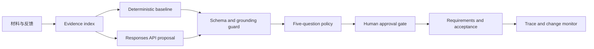

# SpecLoop 产品作品集

## 一句话项目

SpecLoop 是一个证据驱动的需求澄清与验收 Agent：把会议、聊天、反馈和课程项目文档转成可执行需求，同时保留 `原始证据 -> 用户问题 -> 产品决策 -> 需求 -> 验收标准` 的完整追踪关系。

项目不是“AI 自动写 PRD”，而是解决三个更难的业务问题：团队意见矛盾时先决定什么、模型输出凭什么可信、需求变化后哪些旧结论需要重审。

## 我的角色与范围

- 角色：AI 产品设计、Agent 工作流设计、前后端工程、评测与部署。
- 范围：从 0 到 1 定义 MVP，设计人机协作边界，实现可复现 Demo 与真实模型双模式。
- 约束：单人/小组项目、无平台数据、首版不做多人协作和第三方系统双向同步。
- 产品原则：证据先于生成、信息增益先于问题数量、Agent 提案而非替人决策、变更必须可审计。

## 业务问题

普通会议总结会压平冲突。例如产品要求上传 PDF，开发认为首版只支持粘贴；如果模型直接生成一份“看起来完整”的 PRD，团队仍然不知道以谁为准，也无法验收。

SpecLoop 把生成前的决策过程变成产品主流程：

1. 保留原文、来源与行号。
2. 识别冲突、缺失条件和未经验证的假设。
3. 根据材料复杂度分配 1 / 3 / 5 个问题上限，并在阻断项解决后早停。
4. 人类确认后才允许生成需求和 Given/When/Then。
5. 新反馈进入后标记相关决策和需求为 `at-risk`，不静默覆盖历史。

## Agent 系统设计

### 为什么是单 Agent 状态机

首版没有采用复杂多 Agent 编排。需求澄清的风险不是角色数量不足，而是模型越权、依据丢失和状态不可复现。单 Agent 加显式状态机让每个边界可测试：模型只能提出候选，领域状态机拥有最终写入权。

系统不会虚构“Agent 间通信”：状态明确存于 `SpecProject.stage / analysisPlan / questions / decisions / requirements / failureCases / agentRuns / audit`，浏览器键为 `specloop.project.v1`。这比隐藏在对话里的共享记忆更容易回放和定位。

### 证据如何形成数据资产

证据来自用户访谈、会议、聊天、产品反馈、GitHub Issue、项目文档和可选行为日志。采集 pipeline 统一做清洗、切分、内容指纹去重与来源绑定；Provider 失败、非法引用和人工改写进入待审核失败样本池，只有人工接受后才成为回归资产。这是一条审查门控的数据闭环，不是让模型从未审核反馈中自动学习。

来源类型只描述 provenance，不直接决定可信度。一个 claim 的质量应按可验证性、直接性、时效性和交叉佐证判断；Issue 中的情绪语言保留为用户强度信号，但不会自动提高事实可信度或需求优先级。完整政策见 `docs/EVIDENCE_POLICY.md`。

### 模型路由、自评估与降级

系统先对材料做确定性复杂度评估：简单材料留在无模型 baseline，复杂材料路由到 small tier，高风险材料路由到 large tier 并强制人工复核；问题上限随复杂度为 1 / 3 / 5，阻断项解决后若剩余最高 `informationGain < 7` 则早停。模型另外返回置信度、未解决风险和复核建议，但明确标记为 `uncalibrated`，不能覆盖确定性风险门。`OPENAI_MODEL_SMALL` 和 `OPENAI_MODEL_LARGE` 让模型替换与业务策略解耦。

`src/core/modelPolicy.ts` 把 graceful degradation 写成可执行决策：simple 永远可确定性运行；complex 在 Provider、Schema 或 grounding 失败时变为 `deterministic-review`；high-risk 任一硬门失败时变为 `manual-review`。因此即使旗舰模型降价 80%，可能改变的是 tier 映射，而不是证据门禁和人工责任。

其中 `deterministic-review` 保留规则产出的 findings 并要求人工确认；`manual-review` 则阻断高风险自动推进，只提供证据索引和失败原因。失败模型提案在两种模式下都不会进入正式需求状态。

### AI 能力与业务风险映射

| 业务风险 | 产品机制 | Agent 工程实现 |
| --- | --- | --- |
| 模型编造依据 | 每条 finding 必须引用已知证据 | JSON Schema、Zod、evidence ID allowlist |
| 用户被大量问题打断 | 按材料复杂度调整澄清深度 | 信息增益排序、自适应 1 / 3 / 5 问 |
| 模型不可用导致流程中断 | 确定性结果始终可用 | Demo baseline、Provider fallback、审计事件 |
| 需求被新反馈静默覆盖 | 旧结论进入待复核状态 | `challenges` 边、`at-risk` 状态、人工关闭影响 |
| 模型成本不可控 | 每次调用可观察、服务端限流 | usage、成本估算、延迟、request ID、并发/速率限制 |
| API Key 泄漏 | 静态前端不持有密钥 | 独立 Node 服务、Secret 注入、受限 Origin |

## 关键产品决策

### 1. 从“问得全面”改成“信息增益最高”

用户不会因为 Agent 问了 20 个问题而认为它更聪明。正式问题上限固定为 5，优先级由风险、冲突类型和对验收的影响决定。这既是体验约束，也是 Agent 质量门。

### 2. 把追踪做成产品对象而不是文档脚注

Evidence、Problem、Decision、Requirement 和 Criterion 都有稳定 ID 和显式边。用户点击验收标准即可返回原文与行号；导出的 PRD、用户故事和 GitHub Issue 继续保留引用。

### 3. 把模型运行经济性放进 Evaluation

成功和失败调用都保留运行记录。Token 来自 Provider usage，成本按部署时配置的价格估算，未配置价格时显示 `Not priced`，不把未知成本伪装成 0。

### 4. 用风险下限修正“伪简单”材料

旧路由把“用户需要上传 PDF 文档”产生的单个 high-severity 缺失条件计为 2 分，低于 complex 阈值，因此误送 simple。这个 case 说明纯加权总分会掩盖集中风险。`risk-floor-v2` 增加 `highSeverity >= 1` 的 complex 下限，将标注集 replay 从 11/12 修正为 12/12，并以 `upload-failure-risk-floor-regression` 固化。

## 已验证结果

- 自动化测试覆盖证据去重、路由、grounding、追踪、变更选择性、失败样本审核、运行指标和导出契约；测试数以仓库 CI 最新结果为准。
- 演示数据上的需求与验收标准来源覆盖率为 100%；每个节点至少链接一个当前项目中真实存在的 evidence ID，且没有项目外引用。
- 正式澄清队列始终不超过 5 个问题。
- 8 条合成冲突 fixtures 的 binary precision / recall 为 100%，仅代表该小型集合。
- 12 条 simple / complex / high-risk 合成路由 fixtures 当前为 12/12，并输出 3 × 3 混淆矩阵；旧阈值 replay 为 11/12，其中一条固化为 risk-floor 误判回归样本。
- 14 个测试文件共 48 项自动化测试通过；5 次独立本地回归共 240/240 次执行通过，未观察到 flaky case；20 条语言 fixtures 均为合成 smoke/regression 数据。

## 商业假设

北极星指标定义为“需求返工豁免交付率”：进入交付的已接受需求包中，没有因需求歧义重新打开的比例。单位经济模型为 `避免的返工小时 × 人力成本 - 模型成本 - 人工审核成本`。当前尚未接入交付事件，因此这是 pilot 指标而非已取得结果；详见 `docs/BUSINESS_CASE.md`。
- 真实模型边界覆盖成功、上游失败、非法 evidence ID、usage 归一化和未配置价格。
- 生产构建、GitHub Actions、Pages、Docker 和 Render Blueprint 已形成交付链路。

## 尚未验证与下一轮计划

- 20 份以上脱敏课程项目或公开 Issue 讨论上的开放域识别质量。
- 两名标注者的一致性，以及澄清问题的接受率/修改率。
- 真实模型 P50/P95 延迟、平均成本和 fallback 率。
- 公共演示端点在真实访问量下的限流与成本预算。

这些指标是下一轮验证计划，不写成已经取得的业务结果。

## 作品集演示路径

1. 打开 `Guided demo`，运行课程项目范围冲突场景。
2. 在 Requirements 修改一条验收标准，展示人工权限与来源引用。
3. 在 Trace 点击验收节点，回溯到原文与行号。
4. 在 Review 添加“必须现场上传 PDF”的反馈，展示选择性影响分析。
5. 在 Evaluation 展示 Agent 控制面、质量门和真实模型运行指标。
6. 展开 Routing evaluation，解释混淆矩阵与 `upload-failure-risk-floor-regression` 的发现、修正和回归保护。
